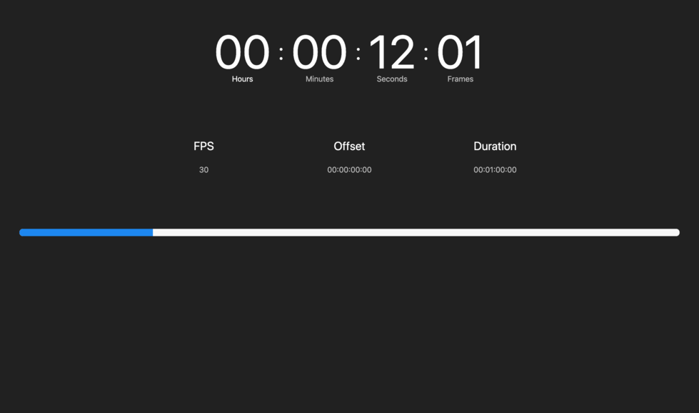

# Timememe

This has been built to allow you to see the current status of Timecode coming out of Timelord.

### Instructions
Best idea on how to get this running, is to simply copy the `timememe.html` file and the `dist` folder into your `www` folder within the TimeLord directory.

Then, simply browse to the normal timelord webpage - but go to `http://address:81/timememe.html`.

### Task List
- [x] Show Timecode
- [x] Show current FPS.
- [x] Show Offset
- [x] Show Duration
- [ ] Show connection status.
- [ ] Add themes.
- [ ] Add Audio/Video slider status.
- [ ] Add Cue list.

#### Credit
Simeon, why you make me do this.

> You need to activate TimeLord to remove this annoying message!
> Please visit TimeLord-MTC.com for your activation code.

RIP in pizzas.